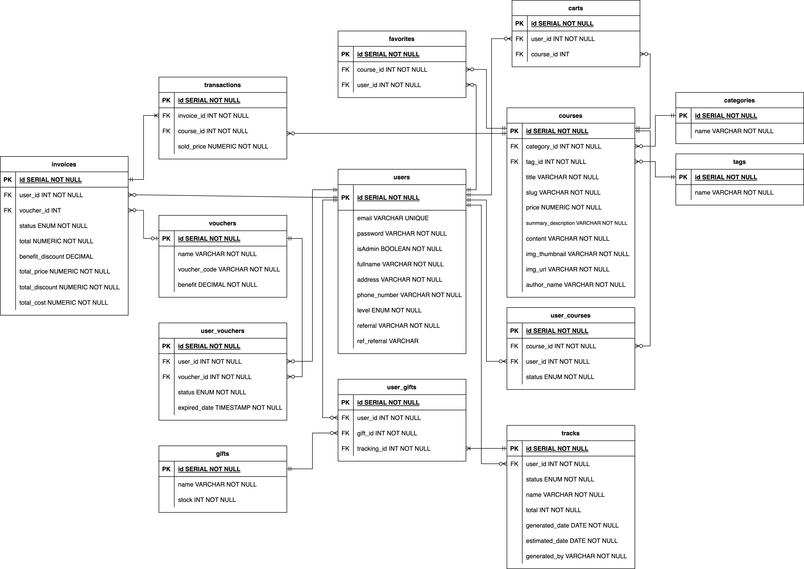

# Online Learning Backend API

This project is about online learning backend. In this project, I provide some related features with online learning website such as: authentication, CRUD of course, course transaction, favorite, voucher, etc.

## ERD
Here I show database design for this project:



# How To Run The Project

## Set Up Database

1. Run file `ddl.sql` to create database and table
2. Run file `seeding.sql` to seed the data

## Set Up Project
run this command in terminal, to make sure you are in the root of this project
```
go run .
``` 

## Test API

1. Import postman collection and you are ready to try
2. Please register and login first before trying some endpoints
3. For authenticated endpoint, make sure you add bearer token
4. For more information, you can refer the documentation [here](https://documenter.getpostman.com/view/13037566/2s93eZxrEi)